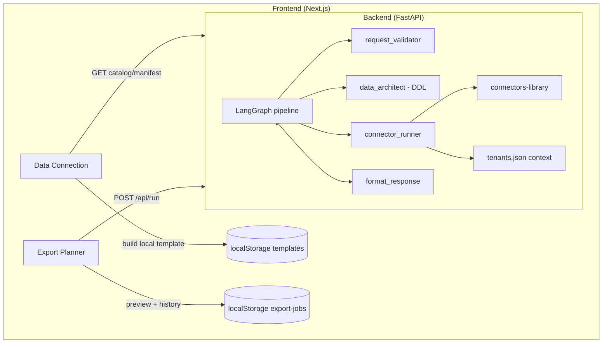

# Integración frontend ↔ API determinística

> Rama de trabajo: `ik-mmi-integration`  
> Última actualización: mayo 2026  
> Alcance: Data Connection (diseño de template) + Export Planner (ejecución real de ingesta)

---

## 1. Visión de producto

El flujo se partió en dos momentos distintos:

| Fase | Pantalla | ¿Llama a la API de ingesta? | Propósito |
|------|----------|-----------------------------|-----------|
| Diseño | Data Connection → Connection, Selectors, **Template** | **No** (`POST /api/run` no se usa aquí) | Elegir conector, campos, reporting scope; armar y **guardar** un template (mapeo de columnas) |
| Ejecución | **Export Planner** (y schedule en Data Export) | **Sí** (`POST /api/run`) | Correr ingesta con el template guardado; ver filas de muestra y conteo |

**Importante:** `POST /api/run` hoy **no escribe en BigQuery/GCS**. Devuelve DDL + `rows_preview` (máx. ~25 filas) + `row_count`. La carga al warehouse queda para una fase posterior.

Las credenciales de la **Credentials Library** (UI) son organizativas para Data Export. El fetch real de Meta usa el **tenant** en `config/tenants.json` vía `MDS_TENANTS_FILE` (ver `scripts/dev-api.sh`).

---

## 2. Arquitectura (alto nivel)



---

## 3. Backend

### 3.1 Endpoints estables (`src/api.py`)

| Método | Ruta | Uso en frontend |
|--------|------|-----------------|
| `GET` | `/api/catalog` | ConnectionStep: lista de conectores |
| `GET` | `/api/catalog/{manifest_id}` | Al elegir conector: `available_fields`, `params`, `table_naming` |
| `POST` | `/api/run` | **Solo Export Planner** (vía `runTemplateIngestion`) |

Endpoints legacy eliminados en Fase 4: `/api/chat`, `/api/submit_input`, `/api/sessions/...`.

**Tenant:** hardcodeado `tenant_id: "dev"` en el handler de `/api/run`. Contexto (token Meta, `ad_account_id`) desde `MDS_TENANTS_FILE` → típicamente `config/tenants.json`.

**Arranque local:**

```bash
./scripts/dev-api.sh   # exporta MDS_TENANTS_FILE=config/tenants.json
```

### 3.2 Pipeline de ingesta (grafo)

Orden conceptual:

1. **request_validator** — valida `manifest_id`, `params` (incl. `fields`, `one_of` de fechas/`days_back`).
2. **data_architect** — genera DDL y `target_table` desde campos elegidos + `bronze_pattern` del manifest.
3. **connector_runner** — importa módulo del submódulo `connectors-library` y llama `fetch(params, context)`.
4. **format_response** — normaliza respuesta para el frontend: `row_count`, `rows_preview`, `columns`, `ddl`, etc.

### 3.3 Cambio en `src/ingestion/dispatcher/base.py`

**Problema:** Los conectores Meta devuelven `"code": "FETCH_OK"` (string). `ConnectorResponse.from_dict` hacía `int(code)` → `500` con `invalid literal for int() with base 10: 'FETCH_OK'` **después** de un fetch exitoso.

**Solución:**

- `ConnectorResponse.code` pasa a ser `int | str`.
- Nueva función `_normalize_connector_code()`:
  - `int` → se mantiene
  - string numérico → `int`
  - string no numérico (ej. `FETCH_OK`, `MISSING_ACCOUNT_ID`) → se conserva como `str`

Sin esto, Export Planner fallaba aunque Meta respondiera bien.

### 3.4 Forma de `POST /api/run`

**Request:**

```json
{
  "manifest_id": "meta_facebook_ad_insights",
  "params": {
    "fields": ["impressions", "spend", "date_start"],
    "days_back": 7
  }
}
```

Alternativa de ventana: `date_start` + `date_stop` (o `since`/`until`) según `one_of` del manifest.

**Response 200 (éxito):** cuerpo de `formatted_response`, p.ej.:

- `manifest_id`, `target_table`, `ddl`, `columns`
- `row_count` — total de filas en el stream canónico (p.ej. `records.ads` para Meta)
- `rows_preview` — primeras filas para UI
- `meta`, `errors` (warnings no fatales)

**Errores:** `400` validación, `502` conector, `500` interno; siempre `X-Request-Id`.

### 3.5 Config local Meta (`config/tenants.json`)

```json
{
  "tenants": {
    "dev": {
      "gcp_project": "...",
      "service_account": "",
      "context": {
        "ad_account_id": "107593029329667",
        "access_token": "..."
      }
    }
  }
}
```

Requerido por `auth.context_required` del manifest de Facebook.

### 3.6 Agregar DV360 (checklist)

**Estado hoy:** el módulo `connectors-library/dv360/reports/dv360_reports.py` implementa `fetch(params, context)`, pero el manifest en catálogo y el loop UI end-to-end están pendientes (ver `docs/migration-plan.md` — Fase 6). Meta es el conector de referencia ya integrado.

El mismo modelo aplica: **`params`** vienen del template en el run; **`context`** viene del tenant (o env vars en dev). La Credentials Library (`DV360` en UI) sigue siendo organizativa hasta que exista resolver multi-tenant / Secret Manager.

#### Contexto en `tenants.json` (DV360)

| Clave en `context` | Obligatorio | Uso |
|--------------------|-------------|-----|
| `query_id` | **Sí** | ID del query/reporte ya creado en la UI de DV360 |
| `service_account_info` | Uno de estos | Objeto JSON de la service account (recomendado en tenant) |
| `service_account_json` | o estos | Mismo JSON como string |
| `access_token` | legacy | Bearer OAuth con scope Bid Manager (alternativa) |

Orden de resolución de credenciales en el conector (si no están en el tenant):

1. `context.service_account_info`
2. `context.service_account_json`
3. `DV360_SERVICE_ACCOUNT_JSON` / `GOOGLE_SERVICE_ACCOUNT_JSON`
4. variables `GOOGLE_SERVICE_ACCOUNT_*`
5. `context.access_token` / `DV360_ACCESS_TOKEN`

**Scope Google:** `https://www.googleapis.com/auth/doubleclickbidmanager`

Ejemplo de tenant `dev` con Meta + DV360 en el mismo `context` (solo se validan las claves que pida el manifest de cada run):

```json
{
  "tenants": {
    "dev": {
      "gcp_project": "tu-proyecto-gcp",
      "service_account": "mds-runner@tu-proyecto.iam.gserviceaccount.com",
      "context": {
        "ad_account_id": "TU_META_AD_ACCOUNT",
        "access_token": "TU_META_TOKEN",

        "query_id": "TU_QUERY_ID_DV360",
        "service_account_json": "{\"type\":\"service_account\",\"project_id\":\"...\", ...}"
      }
    }
  }
}
```

Cuando exista el manifest DV360, `auth.context_required` probablemente incluirá al menos `query_id`. Las credenciales de la SA pueden quedar fuera de `context_required` en dev (env vars) pero en producción deberían vivir en Secret Manager (Fase 5).

**`params` típicos en el run** (desde template / manifest, no del tenant):

- `data_range` — obligatorio (`LAST_7_DAYS`, `CUSTOM_DATES`, etc.)
- `customStartDate` / `customEndDate` — si `data_range` = `CUSTOM_DATES` (formato `YYYYMMDD`)
- `fields` — allow-list de columnas del CSV

#### Fuera del repo (Google + DV360)

1. Proyecto GCP + **service account** con acceso a Display & Video 360 / Bid Manager API.
2. En DV360: crear el **query/report** en la UI y copiar su **`query_id`** al tenant.
3. Conceder a la SA permisos sobre la cuenta DV360 del cliente.

#### Checklist por capa

```text
Google Cloud + DV360 UI     →  query_id + SA con permisos
         ↓
config/tenants.json          →  context.query_id + credenciales SA
         ↓
MDS_TENANTS_FILE + dev-api  →  tenant "dev" (hardcodeado en api.py hoy)
         ↓
connectors-library           →  manifest.json DV360 + bump submodule
         ↓
GET /api/catalog             →  Data Connection elige conector, arma template local
         ↓
Export Planner               →  POST /api/run (params del template + context del tenant)
```

| Capa | Qué hacer |
|------|-----------|
| **Backend** | Publicar `manifest.json` en `connectors-library` (`platform: "dv360"`, `params`, `auth.context_required`); bump submodule; smoke test `POST /api/run`. |
| **Tenant** | Añadir `query_id` + `service_account_json` (o `service_account_info`) en `context` de `config/tenants.json`. |
| **Frontend** | Sin cambios estructurales: catálogo API, `platform-match` ya mapea `dv360` ↔ `DV360`; guardar template con `manifest.platform`; run desde Export Planner vía `runTemplateIngestion`. |
| **UI credenciales** | Entrada DV360 en Credentials Library (documentación); **no** alimenta el run hasta cablear tenant resolver. |

---

## 4. Frontend — integración API

### 4.1 Variable de entorno

- `NEXT_PUBLIC_API_URL` → default `http://localhost:8000`
- `NEXT_PUBLIC_MOCK=true` → ramas mock (SSE viejo, sin API real). En integración real: **comentado / false**.

### 4.2 Capa API (`frontend/src/lib/api/catalog.ts`)

| Función | Endpoint |
|---------|----------|
| `fetchCatalog()` | `GET /api/catalog` |
| `fetchManifest(id)` | `GET /api/catalog/{id}` |
| `runIngestion(manifestId, params)` | `POST /api/run` |

`runIngestion` propaga `requestId` desde header o body en errores.

### 4.3 Store principal (`connectorStore.ts`)

| Modo | Connection | Selection | Template | Run |
|------|------------|-----------|----------|-----|
| Real | `loadCatalog` + `selectConnector` → `fetchManifest` | `fields` del manifest | `proposeTemplateFromSelection()` **local** | `runPipeline()` → API (legacy; no usado en Template step) |
| Mock | SSE + `MOCK_CONNECTORS` | mock fields | `generateMockTemplate` / SSE | SSE |

Helpers relacionados:

- `manifest-default-params.ts` — rellena `days_back` etc. para pasar validación sin UI técnica en Connection.
- `template-proposal.ts` — arma template (columnas, DDL de referencia, nombre de tabla) sin red.

### 4.4 Data Connection — pasos

**ConnectionStep**

- Real: catálogo desde API; al elegir → `fetchManifest`, llena `fields` en store.

**SelectionStep**

- Columnas desde `manifest.available_fields`.
- Reporting scope (campaign / adset / ad) filtra campos en UI.

**TemplateStep**

- **No** llama `runPipeline()` / `POST /api/run`.
- `proposeTemplateFromSelection(reportingLevel)` construye propuesta en cliente.
- Al guardar en `templateStore`: `manifestId`, `platform` = `manifest.platform` (`meta`), `columns`, `endpoint`, `ddl` (referencia).

### 4.5 Matching plataforma (`platform-match.ts`)

`platformsCompatible()` / `canonicalPlatform()` unifican template `meta`, credencial `META`, y manifest id `meta_facebook_ad_insights`.

### 4.6 Export Planner — ejecución (`export-ingestion.ts`)

`runTemplateIngestion(template, options)`:

1. Resuelve `manifestId` (guardado o heurística por `platform` en catálogo).
2. `fetchManifest` + `buildRunParamsFromTemplate` (`fields`, `days_back` o rango de fechas).
3. `POST /api/run`
4. Devuelve `row_count`, `rows_preview`, `columns`, `requestId`.

**Persistencia:** `exportJobStore.lastRuns[]` con preview en localStorage.

**UI:** `RunPreviewDialog` tras run exitoso; botón **Sample** en historial; **Download JSON**.

### 4.7 Schedule Export

- **Weekly:** `dayOfWeek` (0–6).
- **Monthly:** `dayOfMonth` (1–31).
- Componente compartido: `ScheduleFields.tsx`.

El cron que dispare runs programados en backend **aún no existe**; es modelo + UI.

### 4.8 Archivos nuevos / tocados (resumen)

| Archivo | Rol |
|---------|-----|
| `src/ingestion/dispatcher/base.py` | Fix `FETCH_OK` / códigos string |
| `frontend/src/lib/export-ingestion.ts` | Orquestación run desde template |
| `frontend/src/lib/template-proposal.ts` | Template local en Connection |
| `frontend/src/lib/platform-match.ts` | Meta ↔ META ↔ manifest id |
| `frontend/src/lib/export-schedule.ts` | Schedule + resumen legible |
| `frontend/src/components/export-planner/RunPreviewDialog.tsx` | Preview + JSON |
| `TemplateStep.tsx`, `export-planner/page.tsx`, etc. | UX de diseño vs ejecución |

---

## 5. Flujo de prueba recomendado

1. `config/tenants.json` con token + `ad_account_id` válidos.
2. `./scripts/dev-api.sh` + `npm run dev` en `frontend/`.
3. Data Connection: conector Meta → campos → Template → **Save template**.
4. Credentials Library: META (wizard; fetch usa tenants.json).
5. Data Export → Export Planner: **Run now** → modal preview.

---

## 6. Qué falta en backend (alcance actual)

### 6.1 No implementado (esperado para MVP UI)

| Tema | Detalle |
|------|---------|
| **Carga a BigQuery/GCS** | Solo preview; no insert. |
| **Scheduler / cron** | Schedule solo en frontend (localStorage). |
| **Multi-tenant HTTP** | Siempre `dev`; sin `X-Tenant-Id`. |
| **Credenciales desde UI** | No se pasan a `/api/run`; solo `tenants.json`. |
| **DV360 en catálogo** | Código en `connectors-library`; manifest + run E2E pendientes (Fase 6). |
| **HTTPBackend / Cloud Function** | Solo `LocalBackend` (Fase 5). |

### 6.2 APIs útiles más adelante

| API | Para qué |
|-----|----------|
| `GET /health` | Probes / CI |
| `X-Tenant-Id` en `/api/run` | Varias cuentas sin editar JSON |
| Run async + polling | Ingestas largas |
| Test de credenciales | Credentials Library real |

Ninguna es estrictamente necesaria para el loop **template → run → preview** actual.

---

## 7. Modo mock vs real

| `NEXT_PUBLIC_MOCK` | Comportamiento |
|--------------------|----------------|
| `true` | Catálogo mock, SSE, run simulado |
| `false` / ausente | API real; run solo en Export Planner |

---

## 8. Referencias

- `docs/INTEGRATION_PLAN.md` — plan original (Template step pedía `/api/run`; producto lo movió a Export Planner).
- `docs/api.md` — contrato HTTP.
- `connectors-library/meta/facebook/manifest.json` — params y `context_required` (Meta).
- `connectors-library/dv360/reports/dv360_reports.py` — `fetch(params, context)` y auth DV360.
